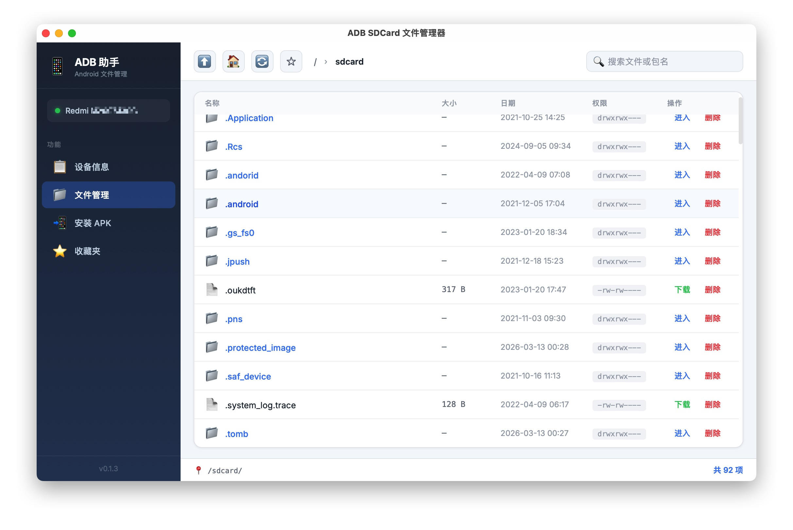

# Android SDCard File Manager

[中文](README_zh.md) | English

A desktop app built with Tauri 2 + React for managing Android device SDCard files via ADB.



## Features

- Device info dashboard (brand, model, Android version, SDK, serial, resolution, battery, storage)
- Browse Android device `/sdcard/` directory
- File search (by filename keyword or Android package name)
- Download files from device to local machine
- Upload files from local machine to device (file picker or drag & drop)
- Delete files/directories on device
- Install local APK files to device
- Preview text files directly in app
- Directory bookmarks (persisted locally)
- Breadcrumb path navigation
- i4Tools-inspired sidebar layout
- Auto-detects system ADB path, also supports bundled ADB

## Prerequisites

- Node.js >= 18
- Rust >= 1.70
- ADB (Android SDK Platform Tools)
- Android device with USB debugging enabled, connected via USB

## Install & Run

```bash
# Install dependencies
npm install

# Development mode
npm run tauri dev

# Production build
npm run tauri build
```

## Tech Stack

- Tauri 2
- React 19 + TypeScript
- Vite 7
- Rust (backend ADB command execution)

## Project Structure

```
├── src/                # React frontend
│   ├── App.tsx         # Main UI component (sidebar + pages)
│   └── App.css         # Styles
├── src-tauri/          # Tauri/Rust backend
│   ├── src/lib.rs      # ADB command wrappers (device-info/list/download/upload/delete/search/install/preview)
│   └── tauri.conf.json # Tauri config
└── package.json
```

## License

MIT
