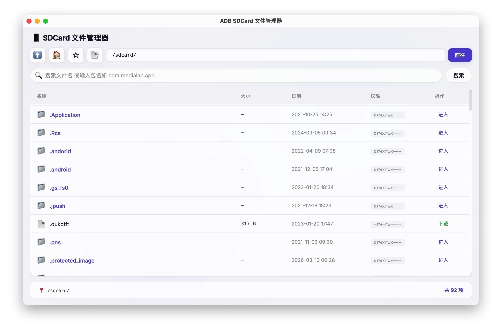

# Android SDCard 文件管理器

中文 | [English](README.md)

基于 Tauri 2 + React 的桌面应用，通过 ADB 管理 Android 设备 SDCard 文件。



## 功能

- 浏览 Android 设备 `/sdcard/` 目录结构
- 文件搜索（支持文件名关键字和 Android 包名直达）
- 下载设备文件到本地
- 目录收藏夹（本地持久化）
- 路径栏直接输入跳转
- 自动检测系统 ADB 路径，也支持内置 ADB

## 环境要求

- Node.js >= 18
- Rust >= 1.70
- ADB（Android SDK Platform Tools）
- Android 设备已开启 USB 调试并通过 USB 连接

## 安装与运行

```bash
# 安装依赖
npm install

# 开发模式
npm run tauri dev

# 构建生产包
npm run tauri build
```

## 技术栈

- Tauri 2
- React 19 + TypeScript
- Vite 7
- Rust（后端 ADB 命令调用）

## 项目结构

```
├── src/                # React 前端
│   ├── App.tsx         # 主界面组件
│   └── App.css         # 样式
├── src-tauri/          # Tauri/Rust 后端
│   ├── src/lib.rs      # ADB 命令封装（list/download/search）
│   └── tauri.conf.json # Tauri 配置
└── package.json
```

## 许可证

MIT
